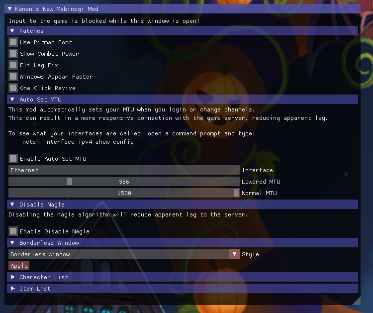

# Kanan's New Mabinogi Mod [](https://github.com/cursey/kanan-new/actions/workflows/build.yml)
A reimagining of Kanan for Mabinogi written in C++ with many improvements.

## Download
Downloads for the latest _official_ releases are located [here](https://github.com/cursey/kanan-new/releases).

## What's new
* Entirely written from the ground up in modern C++17. 
* Overall design was kept simple and *most* of it is commented so beginners can understand whats going on.
* Core memory hacking library is seperate from the Mabinogi specific portion and can be easily reused for other games.
* Includes an ingame UI to configure each mod.
* Includes a reusable Direct3D 9 hook.
* Includes a reusable DirectInput 8 hook.
* Intercepts windows messages sent to the game window.
* Reverse engineered game structures to allow for unique features such as entity viewing.
* A simple and secure Launcher for easy multi-client (WIP)
	* This project makes use of WinHTTP, Cryptography Next Generation (CNG), and WMI APIs
* Probably other things!

## Build requirements
* Visual Studio 2017-2022
* CMake

## Build steps
From the command line you must generate a project using CMake:
```
> cmake -B build -G "Visual Studio 17 2022" -A x64
```

At this point you can now open `/build/Kanan.sln` with visual studio, or continue the build from the command line with:

```
> cmake --build build --config Release
> cmake --install build --prefix out
```

## Usage
Once the project has been built successfully in Release mode just run Loader.exe as an administrator. Loader.exe will automatically look for any instances of Mabinogi and load Kanan.dll into it. Press the INSERT key to toggle the UI.

## This project is still a work in progress
Once this project reaches (or approaches) feature parity with the original Kanan the URL for it will probably change to replace the original. I may periodically release official binaries for those who don't want to build the project themselves.

## Todo
* Add more patches and mods that were previously available in the original Kanan.

## Preview from the very first public version


## Original patch authors
Kanan comes with more mods than are listed here. This is the list of patch authors who haven't directly contributed via GitHub's pull requests.
* Blade3575
    * Bitmap font
    * Elf lag
* Step29
    * NPC fast text
    * One click revive
    * Free indoor camera
    * Hide NPC curtains
    * Hide second title
    * No player zoom transparency
    * Mana tunnel lag fix
    * No skill rank up window
    * Windows appear faster
    * Uncapped auto production
    * Mini title menu (TitleOrganize)
    * Mute commerce imp (NoImp)
    * No render sky
* Rydian
    * Transformation mastery collect mode always enabled
    * No persistent fighter chain popup
    * Objects between camera and character do not become transparent
    * Hide main title

Many original patches/ideas came from the following projects:
* Fantasia
* MAMP
* JAP
* Gerent/GerentxNogi
* MNG
* Noginogi-Party

## Projects that use or were inspired by Kanan
* [RE2 Mod Framework](https://github.com/praydog/RE2-Mod-Framework) - Mods for the Resident Evil 2 Remake
